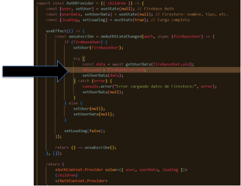

Guía Técnica – CRUD de Productos con Firebase y React (EcoFood) 

Esta guía muestra cómo implementar el módulo de gestión de productos para una empresa en el sistema EcoFood. Se trabaja con Firebase Firestore, React, Bootstrap y SweetAlert2 para crear una experiencia completa de CRUD, incluyendo búsqueda, paginación y asociación a empresas. 

**¿Qué aprenderás con esta guía?** 

- Crear y asociar productos por empresa 
- Implementar búsqueda en Firestore con índices} 
- Aplicar paginación por bloques (next/prev) 
- Usar modales Bootstrap para CRUD 
- Organizar la lógica de servicios fuera del componente 

**Contexto y Autenticación** 

En el archivo AuthProvider.jsx, se agregó:  data.uid = firebaseUser.uid;  

Esto permite que el objeto  userData  en React tenga el mismo UID que usa Firebase Auth. Gracias a esto, podemos asociar cada producto al  empresaId  desde 

` `userData.uid , garantizando que una empresa vea y gestione solo sus propios productos. 

extracto del codigo :  (src\context\AuthProvider.jsx) 

**Pagina Productos.jsx** 

(src\pages\empresa\Productos.jsx) 

Este componente actúa como contenedor del CRUD. Permite agregar, editar, eliminar productos, buscar por nombre y refrescar la lista. Incluye integración con Bootstrap, SweetAlert2 y usa componentes hijos como TablaProductos y ModalProductos. 

import { useState, useCallback } from "react"; 

import { useAuth } from "../../context/AuthContext"; 

import Swal from "sweetalert2"; 

import { deleteProducto } from "../../services/productoService"; 

import TablaProductos from '../../components/empresa/TablaProductos' ![ref1]import ModalProductos from '../../components/empresa/ModalProductos' 

export default function Productos() { 

`    `const { userData } = useAuth(); 

`    `const [busqueda, setBusqueda] = useState(""); 

`    `const [refreshTick, setRefreshTick] = useState(0);  // para refetch después de borrar     const [showModal, setShowModal] = useState(false); 

`    `const [formData, setFormData] = useState({ nombre: "", descripcion: "", precio: 0, vencimiento: "", id: null }); 

`    `const handleRefresh = () => { 

`        `setRefreshTick((t) => t + 1)     }; 

`    `const eliminar = useCallback(async (id) => { 

`        `try { 

`           `const confirm = await Swal.fire({ title: "¿Eliminar producto?", showCancelButton: true }); 

`            `if (confirm.isConfirmed) { 

`                `await deleteProducto(id); 

`                `handleRefresh() 

`            `} else { return;} 

`        `} catch (e) { 

`            `console.error(e); 

`            `alert('Error al eliminar'); // manejo simple; mejora a tu gusto 

`        `} 

`    `}, []); 

`    `const abrirModal = (producto = null) => { 

`        `if (producto) { 

`            `setFormData({ ...producto }); 

`        `} else { 

`            `setFormData({ nombre: "", descripcion: "", precio: 0, vencimiento: "", id: null });         } 

`        `setShowModal(true);     }; 

`    `return (<> 

`        `
             
 

 

`                    `<h3>Gestión de Productos</h3> 

`                `
 

`                `

 

`                `
 

`                    `<button className="btn btn-primary" onClick={() => abrirModal()} >Agregar Producto</button> 

`                `
 

`                `
 

`                    `
 

`                        `<input className="form-control" type="search" placeholder="Buscar nombre" value={busqueda} onChange={(e) => setBusqueda(e.target.value)} /> 

`                        `<button className="btn btn-outline-success" onClick={() => handleRefresh() } ><i className="fa-solid fa-arrows-rotate"></i></button> 

`                    `
 

`                `
 

`                `
 

`                    `<TablaProductos 

`                        `key={refreshTick} 

`                        `busqueda={busqueda} 

`                        `userData={userData} 

`                        `eliminar={(id) => eliminar(id) } 

`                        `abrirModal={(p) => abrirModal(p) } 

`                    `/> 

`                `
 

`            `
 

`        `
 

`        `<ModalProductos 

`            `id={'productoModal'} 

`            `show={showModal} 

`            `setShow={setShowModal} 

`            `userData={userData} 

`            `formData={formData} 

`            `setFormData={setFormData} 

`            `abrirModal={(p)=> abrirModal(p) } 

`            `handleRefresh={ handleRefresh } 

`        `/> 

`    `</>); 

} 

**Componente TablaProductos.jsx** 

(src\components\empresa\TablaProductos.jsx) 

Carga y muestra los productos paginados en bloques. Se usa paginación con  startAfter()  y almacenamiento del historial de documentos en  historial[] . Se desactiva el botón 'Anterior' en la primera página y 'Siguiente' si no hay más documentos. 

El paginador está implementado con Bootstrap y la tabla permite editar y eliminar productos directamente. 

import { useEffect, useState } from "react"; 

import PropTypes from 'prop-types'; 

import { obtenerTotalProductos, getProductosByEmpresaPagina, PAGE\_SIZE } from '../../services/productoService'; 

TablaProductos.propTypes = { 

`    `userData: PropTypes.object, 

`    `busqueda: PropTypes.string, 

`    `eliminar: PropTypes.func.isRequired,     abrirModal: PropTypes.func.isRequired, }; 

export default function TablaProductos({ userData, busqueda , eliminar, abrirModal}) {     const [total, setTotal] = useState(0); 

`    `const [historial, setHistorial] = useState([]); 

`    `const [pagina, setPagina] = useState(0); 

`    `const [productos, setProductos] = useState([]); 

`    `const [sinMas, setSinMas] = useState(false); 

`    `useEffect(() => { 

`        `if (!userData) return; 

`        `const fetchTotal = async () => { 

`            `const cantidad = await obtenerTotalProductos(userData.uid, busqueda);             setTotal(cantidad); 

`        `}; 

`        `fetchTotal(); 

`    `}, [userData, busqueda]); 

`    `useEffect(() => { 

`        `const cargarPagina = async () => {             let cursor = null; 

if ( pagina > 0) { 

`                `cursor = historial[pagina - 1] || null;             } 

`            `const { productos: nuevos, lastVisible } = await getProductosByEmpresaPagina(userData.uid, cursor, busqueda);             setProductos(nuevos); 

`            `setHistorial(prev => { 

`                `const copia = [...prev]; 

`                `copia[pagina] = lastVisible; 

`                `return copia; 

`            `}); 

`            `setSinMas(nuevos.length < PAGE\_SIZE);         }; 

`        `if (userData) { 

`            `cargarPagina(null); // carga la primera página         } 

`    `// eslint-disable-next-line react-hooks/exhaustive-deps     }, [pagina,  userData, busqueda]); 

`    `return ( 

`        `
 

`            `
 

`                `<ul className="list-group mb-3"> 

`                    `{productos.map((p, i) => ( 

`                        `<li key={i} className="list-group-item d-flex justify-content- between align-items-center"> 

`                            `{p.nombre} - ${p.precio} 

`                            `
 

`                                `<button className="btn btn-warning btn-sm me-2" onClick={() => abrirModal(p)}>Editar</button> 

`                                `<button className="btn btn-danger btn-sm" onClick={() => eliminar(p.id)}>Eliminar</button> 

`                            `
 

`                        `</li> 

`                    `))} 

`                `</ul> 

`            `
 

`            `

Total de productos: {total}

 

`            `
 

`                `<nav> 

`                    `<ul className="pagination"> 

`                        `<li className={ page-item ${pagina < 1 ? "disabled" : ""} }> 

`                            `<button className="page-link" onClick={() => setPagina(p => p - 1)}><i className="fa-solid fa-arrow-left"></i></button> 

`                        `</li> 

`                        `<li className={ page-item ${sinMas ? "disabled" : ""} }> 

`                            `<button className="page-link" onClick={() => setPagina(p => p + 1)}><i className="fa-solid fa-arrow-right"></i></button> 

`                        `</li> 

`                    `</ul> 

`                `</nav> 

`            `
 

`        `
 

`    `); 

} 

**Componente ModalProductos.jsx** 

Contiene el formulario para agregar y actualizar productos. El formulario está dentro de un modal de Bootstrap. Al guardar, se decide si usar  addProducto  o  updateProducto , y se asocia cada nuevo producto con  empresaId = userData.uid . 

(Instalar dependencia**:  npm install react-bootstrap bootstrap** ) 

import { addProducto, updateProducto } from '../../services/productoService'; import Swal from "sweetalert2"; 

import { Modal } from "react-bootstrap"; 

export default function AddProductos({ show, setShow, userData, handleRefresh, formData, setFormData}) { 

`    `const guardarProducto = async (e) => { 

`        `e.preventDefault(); 

`        `if (formData.id) { 

`            `await updateProducto(formData.id, formData); 

`            `Swal.fire("Actualizado correctamente", "", "success"); 

`        `} else { 

`            `await addProducto({ ...formData, empresaId: userData.uid }); 

`            `Swal.fire("Agregado correctamente", "", "success"); 

`        `} 

`        `handleRefresh();         setShow(false)     }; 

`    `return ( 

`        `<Modal 

`            `show={show} 

`            `onHide={() => setShow(false)} 

`            `centered 

`            `backdrop="static" 

`            `keyboard={false} 

`            `> 

`            `<Modal.Header > 

`                `<Modal.Title>{formData.id ? "Editar" : "Agregar"} Producto</Modal.Title> 

`            `</Modal.Header> 

`            `<form onSubmit={guardarProducto}> 

`                `<Modal.Body closeButton>  

`                    `<input className="form-control mb-2" placeholder="Nombre" value={formData.nombre} onChange={(e) => setFormData({ ...formData, nombre: e.target.value })} />                     <textarea className="form-control mb-2" placeholder="Descripción" value={formData.descripcion} onChange={(e) => setFormData({ ...formData, descripcion: e.target.value })}></textarea> 

`                    `<input type="number" className="form-control mb-2" placeholder="Precio" value={formData.precio} onChange={(e) => setFormData({ ...formData, precio: e.target.value })} />                     <input type="date" className="form-control" value={formData.vencimiento} onChange={(e) => setFormData({ ...formData, vencimiento: e.target.value })} /> 

`                `</Modal.Body> 

`                `<Modal.Footer> 

`                    `<button type="button" className="btn btn-secondary" onClick={() => setShow(false)}>Cerrar</button> 

`                    `<button type="submit" className="btn btn-success">Guardar</button> 

`                `</Modal.Footer> 

`            `</form> 

`        `</Modal> 

`    `); 

} 

**Servicios – productoService.js** 

(src\services\productoService.js) 

Incluye funciones para: 

`  `addProducto : Genera un ID automático y asocia el producto a la empresa.   updateProducto  y  deleteProducto : Editan y eliminan productos por ID. 

`  `obtenerTotalProductos : Devuelve el conteo de productos con búsqueda opcional. 

- getProductosByEmpresaPagina : Soporta paginación y búsqueda en Firestore usando 

` `startAt ,  endAt ,  startAfter . 

Todos los productos están filtrados por  empresaId , lo que protege los datos de otras empresas. 

import { db } from "./firebase"; 

import { collection, 

`    `setDoc, 

`    `getDocs, 

`    `updateDoc, 

`    `query, 

`    `where, 

`    `deleteDoc, 

`    `doc, 

`    `orderBy, 

`    `limit, 

`    `startAt, 

`    `endAt, 

`    `startAfter, 

`    `getCountFromServer,     // SDK v9+ → consulta agregada COUNT } from "firebase/firestore"; 

export const addProducto = async (producto) => { 

`    `const ref = doc(collection(db, "productos")); // genera ID     const productoConId = { ...producto, id: ref.id }; 

`    `await setDoc(ref, productoConId); 

}; 

export const deleteProducto = async (id) => await deleteDoc(doc(db, "productos", id)); 

export const updateProducto = async (id, data) => {     const ref = doc(db, "productos", id); 

`    `await updateDoc(ref, data); 

}; 

export async function obtenerTotalProductos(empresaId, busqueda = "") {     // 1. Referencia a la colección 

`    `const productosRef = collection(db, "productos"); 

// 2. Construir la query base (filtra por empresa) 

let q = query(productosRef, where("empresaId", "==", empresaId)); 

`    `// 3. Si hay término de búsqueda, aplicar rango "empieza con" ![ref1]

`    `if (busqueda.trim() !== "") { 

`        `const term = busqueda.toLowerCase(); 

`        `q = query( 

`            `q, 

`            `orderBy("nombre"),            // ya necesitas un índice compuesto             startAt(term), 

`            `endAt(term + "\uf8ff") 

`        `); 

`    `} 

`    `// 4. Consulta agregada COUNT (solo metadata, NO lee todos los docs)     const snapshot = await getCountFromServer(q); 

`    `return snapshot.data().count;       // número entero 

} 

export const PAGE\_SIZE = 5; 

export const getProductosByEmpresaPagina = async (empresaId, cursor = null, nombre = "") => { 

`    `let ref = collection(db, "productos"); 

`    `let q = query(ref, 

`        `where("empresaId", "==", empresaId), 

`        `orderBy("nombre"), 

`        `startAt(nombre), 

`        `endAt(nombre + "\uf8ff"), 

`        `limit(PAGE\_SIZE) 

`    `); 

`    `if (cursor) { 

`        `q = query(ref, 

`            `where("empresaId", "==", empresaId),             orderBy("nombre"), 

`            `startAt(nombre), 

`            `endAt(nombre + "\uf8ff"), 

`            `startAfter(cursor), 

`            `limit(PAGE\_SIZE)); 

`    `} 

const snapshot = await getDocs(q); 

const productos = snapshot.docs.map(doc => ({ id: doc.id, ...doc.data() })); const lastVisible = snapshot.docs[snapshot.docs.length - 1]; 

`    `return { productos, lastVisible }; };

**Error común: Requiere índice Firestore (FirebaseError)** 

Al utilizar filtros como  where()  junto con  orderBy()  en la misma consulta de Firestore, Firebase requiere que exista un índice compuesto entre esos campos. Si no existe, verás el siguiente error: 

FirebaseError: The query requires an index. That index is currently building and cannot be used yet. 

**¿Cómo resolverlo?** 

1. Ejecuta la búsqueda como lo harías normalmente desde la aplicación. 
1. Copia o haz clic en el enlace que Firebase proporciona en la consola (empieza con  https://console.firebase.google.com/... ). 
1. Se abrirá la consola con una pantalla de confirmación para crear el índice. 

   4. Haz clic en \*\*“Crear índice”\*\*. 

4\.  Espera a que cambie de “Construyendo…” a “Listo”. Esto puede tardar entre 10 

segundos y 1 minuto. 

Una vez que el índice esté activo, tu consulta funcionará sin errores. 

**Ejemplo de consulta que requiere índice** 

query( 

`  `collection(db, "productos"), 

`  `where("empresaId", "==", empresaId),   orderBy("nombre") 

) 

Este patrón necesita un índice que combine  empresaId  (filtro) con  nombre  (ordenamiento). 

[ref1]: Aspose.Words.a81543a7-79eb-463d-abb9-8103a20d759d.004.png
